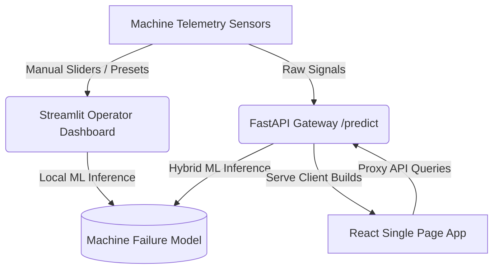

# 🛡️ AegisMind: Industrial Predictive maintenance Platform

AegisMind is an enterprise-grade predictive maintenance gateway and analytics dashboard designed for edge deployment on factory floors. It utilizes a **hybrid machine learning model (Isolation Forest + XGBoost)** to process active machine telemetry parameters and isolate equipment failures before they occur.

---

## 🏗️ System Architecture

The project consists of three core components:



### 1. Hybrid ML Predictive Core (`app/machine_failure_model.joblib`)
* **Unsupervised Anomaly Extractor**: An Isolation Forest model fitted strictly on nominal training bounds to extract real-time anomaly indices.
* **Supervised Hyper-Booster**: An XGBoost Classifier that runs on scaled combination spaces to compute highly accurate failure probability vectors.
* **Leakage-Proof Pipeline**: A pre-fit `StandardScaler` ensuring that feature scales do not leak from validation splits.

### 2. Streamlit Command Center (`app/dashboard.py`)
* **Operator Session Gate**: A secure login/signup page with SHA-256 hashed password storage (`app/users.json`) and session lock controls.
* **Glassmorphic Telemetry HUD**: Clean oklch dark-themed metric cards highlighting System Health, Failure Probability gauges, Anomaly Indices, and Structural Stress metrics.
* **Audible Siren Warnings**: Injects a base64-encoded warning beep that autoplays as soon as a `BREACH` threshold is met. Includes a JavaScript listener fallback to bypass strict browser autoplay blocks.
* **Live Telemetry Simulator**: Walks parameters dynamically every `1.0s` to show active real-time updates.
* **Interactive Plotly Visuals**: Mapped dark-theme templates showing threat propagation lines and anomaly score horizons.

### 3. Unified API Gateway (`app/main.py`)
* **FastAPI Server**: High-performance HTTP server serving ML predictions.
* **CORS Support**: Development proxy configurations enabling remote connections.
* **Unified Serving**: Optionally mounts the compiled production React client on the `/` root route.

### 4. React + TypeScript Dashboard SPA (`frontend/`)
* **Vite React Application**: An alternative high-performance web dashboard featuring Recharts line/area plots, custom sliders, preset overrides, and clean tabular logs with CSV data exporting.

---

## ⚙️ Quick Start Guide

### Prerequisites
Make sure you have Python 3.10+ and Node.js 18+ installed on your system.

### Virtual Environment Setup
Before running the Python scripts, activate the virtual environment to ensure all packages (FastAPI, Streamlit, XGBoost, Scikit-Learn, Plotly) are available:
```bash
# Activate virtual environment
source venv/bin/activate
```

---

## 🏃 Running the Application

### 1. Launch the Streamlit Operator Dashboard
The main operator console is hosted live on Streamlit Community Cloud at:
👉 **[dspro1-aytnvxltnbssqwpxzqyfwz.streamlit.app](https://dspro1-aytnvxltnbssqwpxzqyfwz.streamlit.app/)**

To run it locally:
```bash
# Make sure venv is active
streamlit run app/dashboard.py --server.port 8501
```
Navigate to `http://localhost:8501` to access the console.

### 2. Launch the FastAPI Prediction Gateway
To start the FastAPI server:
```bash
# Make sure venv is active
uvicorn app.main:app --reload --port 8000
```
* **API Documentation**: Access the Swagger UI docs at `http://localhost:8000/docs`.
* **System Metadata**: Query the model metadata at `http://localhost:8000/info`.

### 3. Run the React Web Dashboard (Alternative Frontend)
To run the React development server:
```bash
# Navigate to the frontend folder
cd frontend

# Install packages
npm install

# Start development server
npm run dev
```
Navigate to `http://localhost:5173`. The Vite server will proxy predictions to the FastAPI server running on port 8000.

To build the React application for production serving through FastAPI:
```bash
# Build React assets
npm run build
```
Once compiled to `frontend/dist/`, restarting the FastAPI server will automatically serve the React app directly at `http://localhost:8000/`.

---

## 📡 API Reference

### 1. Get Model Info
* **Route**: `/info`
* **Method**: `GET`
* **Response**:
  ```json
  {
    "optimal_threshold": 0.4248,
    "model_version": "v10.0.0"
  }
  ```

### 2. Predict Machine Failure
* **Route**: `/predict`
* **Method**: `POST`
* **Request Body**:
  ```json
  {
    "air_temperature_k": 300.0,
    "process_temperature_k": 310.0,
    "rotational_speed_rpm": 1500.0,
    "torque_nm": 40.0,
    "tool_wear_min": 60.0
  }
  ```
* **Response Body**:
  ```json
  {
    "prediction_status": "Operational Status: Nominal",
    "failure_binary_label": 0,
    "calculated_failure_probability": 0.03,
    "enforced_hybrid_threshold": "42.48%",
    "extracted_metrics": {
      "live_anomaly_score": -0.4389,
      "live_torque_velocity": 0.0,
      "live_thermal_rolling_std": 0.0
    }
  }
  ```

---

## 📁 Repository Structure

```
dspro1/
├── app/
│   ├── dashboard.py               # Streamlit application
│   ├── main.py                    # FastAPI server
│   ├── users.json                 # Persisted credentials database (Ignored)
│   └── machine_failure_model.joblib # Production model pipeline
├── data/
│   └── raw/                       # Telemetry training logs
├── frontend/                      # Vite + React + TS dashboard
│   ├── src/
│   │   ├── App.tsx                # React dashboard logic
│   │   └── index.css              # Custom oklch layout system
│   └── vite.config.ts             # Proxy setup
├── src/
│   ├── data_ingestion.py          # Data ingestion script
│   └── model_training.py          # Model training pipeline
├── requirements.txt               # Main Python dependencies
└── README.md                      # This file
```
